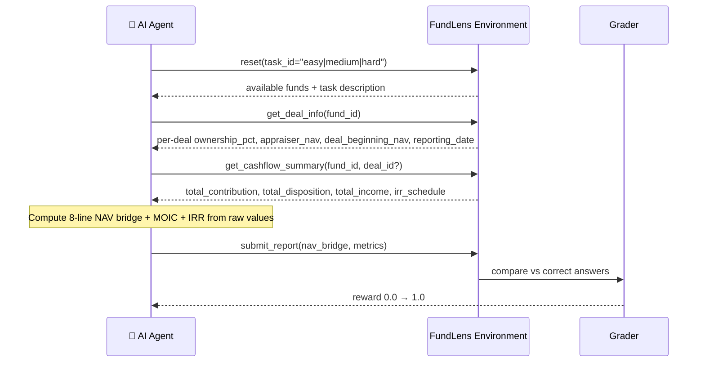
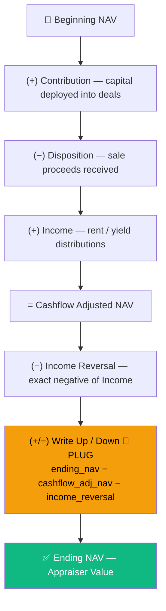
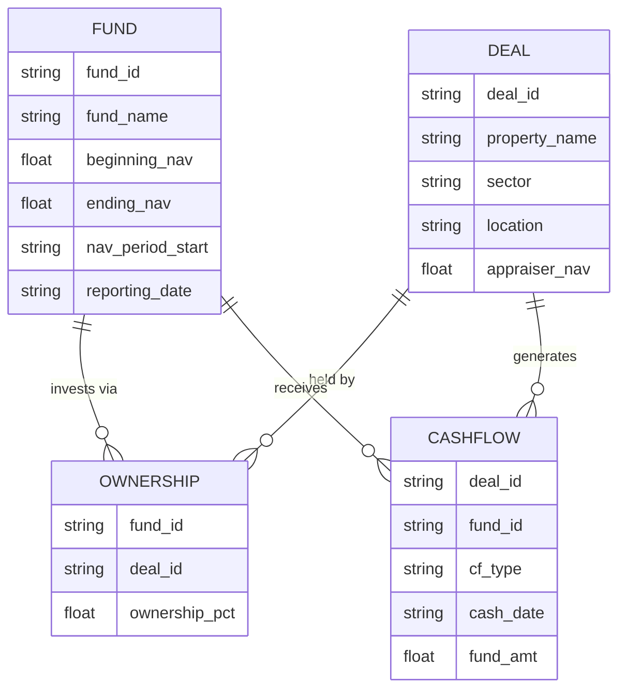

# 🏢 FundLens


> **A real-world RL environment where AI agents act as PE fund analysts** — computing NAV bridges and performance metrics across Indian real estate portfolios.

---

## What is FundLens?

Fund analysts spend hours building **NAV bridges** in Excel — reconciling a fund's starting value to its ending value by walking through every cashflow adjustment. FundLens turns this into a graded AI challenge.

An AI agent is given raw fund data and must:
1. Fetch deal-level property info (ownership %, appraiser NAV, beginning NAV) using `get_deal_info`
2. Fetch pre-aggregated cashflow totals using `get_cashflow_summary` (scales to 100k+ rows)
3. Compute the **8-line NAV bridge** (beginning NAV → ending NAV) from scratch
4. Calculate performance metrics (MOIC, IRR)
5. Submit its answer and receive a reward between **0.0 and 1.0**

---

## How It Works



---

## Analysis Levels

FundLens supports three levels of computation — the same formulas apply at every level:

| Level | Scope | beginning_nav source |
|-------|-------|----------------------|
| **Portfolio** | Summed across all funds | sum of all fund beginning_navs |
| **Fund** | Single fund | `fund_beginning_nav` from `get_deal_info` |
| **Investment / Deal** | Single deal within a fund | `deal_beginning_nav` from `get_deal_info` (proportionally allocated) |

> `deal_beginning_nav = fund.beginning_nav × (deal_fund_share_nav / fund.ending_nav)`

---

## The NAV Bridge

The core financial concept this environment tests. Every line item must be computed from raw data — the **Write Up/Down is always the plug** (derived, never given).



**Formulas:**
```
cashflow_adjusted_nav = beginning_nav + contribution − disposition + income
income_reversal       = −income
write_up_down         = ending_nav − (cashflow_adjusted_nav + income_reversal)   ← THE PLUG
```

**Metrics:**
```
MOIC = (total_disposition + total_income + ending_nav) / total_contribution
IRR  = XIRR(irr_schedule + [{date: reporting_date, amount: ending_nav}])
```

---

## Data Model



---

## Tasks

| # | Task ID | Fund | Deals | Challenge |
|---|---------|------|-------|-----------|
| 1 | `easy` | RE Alpha Fund I | 3 × 100% owned (Office, Residential, Industrial) | 8-line NAV bridge only |
| 2 | `medium` | RE Beta Fund II | 5 deals including Data Center | NAV bridge + fund MOIC |
| 3 | `hard` | Alpha + Beta + Gamma | Cross-fund, Prestige Tower co-invested (Beta 40%, Gamma 35%) | NAV bridge + MOIC + IRR |

---

## MCP Tools

### Computation tools (AI uses these)

| Tool | What it returns |
|------|----------------|
| `get_available_filters()` | Fund IDs, deal IDs, sectors in scope |
| `get_deal_info(fund_id)` | Per-deal: sector, ownership_pct, appraiser_nav, fund_share_nav, **deal_beginning_nav** |
| `get_cashflow_summary(fund_id, deal_id?)` | Pre-aggregated totals + IRR schedule — **scales to any row count** |
| `get_raw_cashflows(fund_id, deal_id?, limit, offset)` | Paginated raw transactions (for audit / drill-down) |
| `submit_report(nav_bridge, metrics)` | Grade submission → reward 0.0–1.0 |

### Exploration tools

| Tool | What it returns |
|------|----------------|
| `get_portfolio_summary(funds?)` | MOIC, IRR per fund |
| `get_nav_bridge(fund_id)` | Pre-computed 8-line NAV bridge |
| `get_portfolio_bridge()` | NAV bridge summed across all funds |
| `get_deal_bridge(fund_id, deal_id)` | NAV bridge for a single deal |
| `get_deal_metrics(fund_id, deal_id)` | MOIC + IRR for a single deal |
| `get_portfolio_metrics()` | MOIC + IRR pooled across all funds |
| `get_irr(fund_id)` | IRR from historical cashflows + terminal NAV |
| `compare_funds(funds?, metrics?)` | Side-by-side fund comparison |
| `get_sector_report(sector?, funds?)` | Breakdown by property sector |
| `get_deal_exposure(deal_id)` | Cross-fund deal consolidation |

---

## Scalability — `get_cashflow_summary`

The environment is designed to handle large datasets without overloading the AI's context window. `get_cashflow_summary` performs server-side aggregation and always returns a compact response regardless of source row count:

```json
{
  "total_contribution": 10.0,
  "total_disposition":  2.0,
  "total_income":       1.07,
  "irr_schedule": [
    {"date": "2022-03-01", "net_amount": -5.0},
    {"date": "2023-06-30", "net_amount": -5.0},
    {"date": "2024-03-15", "net_amount":  2.0}
  ],
  "source_row_count": 9
}
```

For raw data access at scale, `get_raw_cashflows` supports pagination:
```json
{"limit": 200, "offset": 0, "total": 100000, "has_more": true, "records": [...]}
```

---

## Grading

Partial credit is awarded per line item — a mostly-right answer still scores well.

| Metric type | Tolerance |
|-------------|-----------|
| NAV bridge amounts (USD M) | ± $0.50M |
| MOIC | ± 0.02x |
| IRR | ± 1% absolute |

---

## Project Structure

```
fundlens/
├── models.py               ← Pydantic types: Fund, Deal, Cashflow, Observation
├── admin/
│   ├── ui.py               ← Gradio admin dashboard (/admin) — AI test runner + answer key
│   └── templates.py        ← Excel templates + bulk upload parsers
├── investor/
│   └── ui.py               ← Read-only investor portal (/investor)
└── server/
    ├── environment.py      ← MCPEnvironment — 14 MCP tools, reset / step / state
    ├── seed_data.py        ← 3 hardcoded fund scenarios (easy / medium / hard)
    ├── calculations.py     ← NAV bridge, XIRR — pure Python, no scipy
    ├── grader.py           ← Reward computation 0.0–1.0
    ├── data_store.py       ← In-memory + SQLite store
    └── app.py              ← FastAPI server entry point

inference.py                ← Baseline agent (OpenAI-compatible LLM)
Dockerfile                  ← Container definition
openenv.yaml                ← Environment manifest
```

---

## Quick Start

```bash
pip install -e .
python -m uvicorn fundlens.server.app:app --host 0.0.0.0 --port 8000
```

| Endpoint | URL |
|----------|-----|
| Admin dashboard | http://localhost:8000/admin |
| Investor portal | http://localhost:8000/investor |
| API docs | http://localhost:8000/docs |
| Health check | http://localhost:8000/health |

## Baseline Agent

```bash
export API_BASE_URL=https://router.huggingface.co/v1
export MODEL_NAME=nvidia/Llama-3.1-Nemotron-70B-Instruct-HF
export HF_TOKEN=your-token
python inference.py
```

## Docker

```bash
docker build -t fundlens .
docker run -p 8000:8000 fundlens
```

---

## Baseline Scores

| Task | Score |
|------|-------|
| `easy` | ~0.72 |
| `medium` | ~0.58 |
| `hard` | ~0.41 |

---

## Built With

[OpenEnv](https://github.com/meta-pytorch/OpenEnv) · [FastMCP](https://github.com/jlowin/fastmcp) · [Gradio](https://gradio.app) · [FastAPI](https://fastapi.tiangolo.com) · [Pydantic](https://docs.pydantic.dev)

---

*Built for the Meta × Scaler Hackathon 2026*
